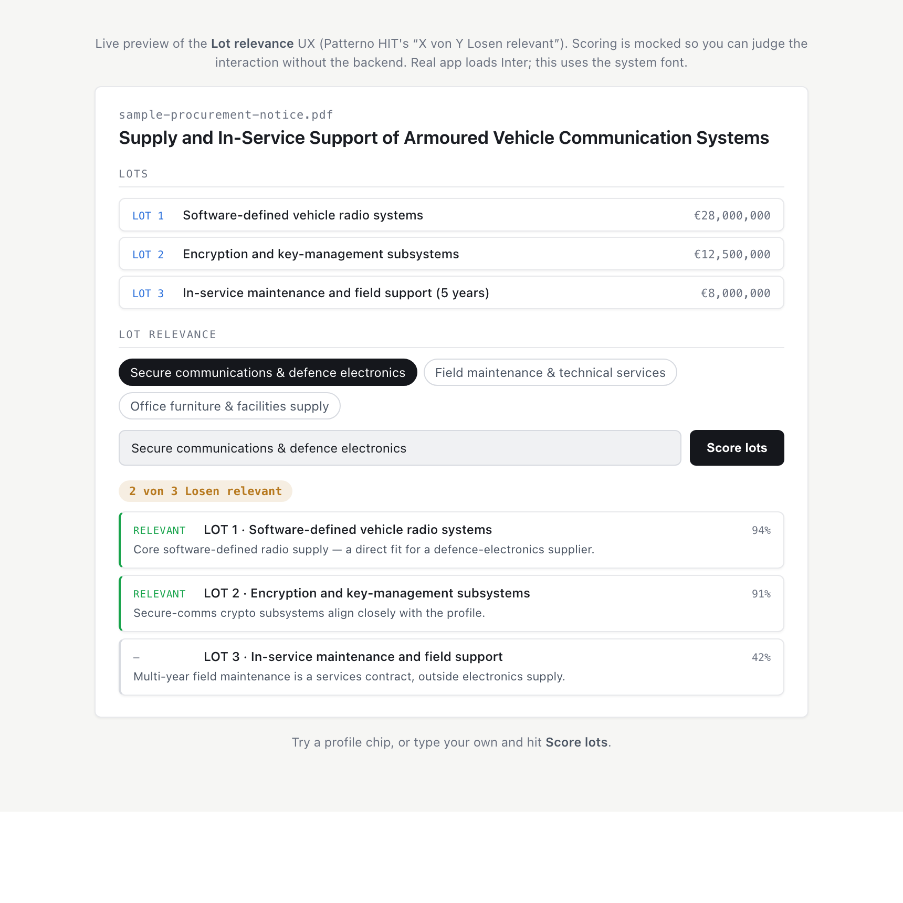
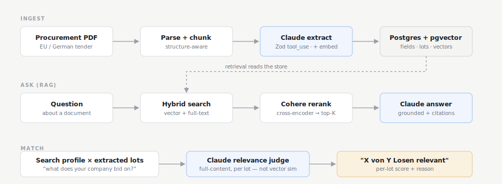

# Patterno Demo — Procurement Document Intelligence

Structured extraction, hybrid-search RAG, and **per-lot relevance scoring** over EU & German procurement documents.
Built on **TanStack Start** (React 19 + SSR) + **pgvector** + **Claude** — the same stack Patterno uses in production.

**The core problem:** getting LLM extraction accuracy from ~80% to 95%+ on structured official documents. The approach is architectural, not prompt-engineering.

🔗 **Landing page** (GitHub Pages): `https://<your-username>.github.io/patterno-tanstack/` · **Demo video:** `<loom link>`



---

## Stack

| Layer | Technology |
|---|---|
| Framework | TanStack Start (React 19, SSR, file-based routing) |
| API layer | TanStack Start server functions (replaces Express — runs server-only) |
| Database | PostgreSQL + pgvector + Drizzle ORM |
| LLM extraction | Anthropic Claude `claude-sonnet-4-6` via tool_use |
| Embeddings | OpenAI `text-embedding-3-small` (1536 dims) |
| Reranker | Cohere `rerank-v3.5` (cross-encoder, optional) |
| Lot relevance | Claude full-content judge, per lot — not vector similarity |
| Schema validation | Zod |
| Hosting | Landing page on GitHub Pages (`/docs`); the app runs locally or on any Node host |

---

## Why TanStack Start over Express + static HTML

The previous version served a static `dashboard.html` from Express. This meant
the API base URL had to be hardcoded in the client, and any hosted version
(GitHub Pages) would expose the API URL publicly.

TanStack Start server functions solve this cleanly:

```ts
// app/routes/index.tsx
const getDocuments = createServerFn({ method: "GET" }).handler(async () => {
  // Runs ONLY on the server. DATABASE_URL, ANTHROPIC_API_KEY, etc.
  // are never sent to the browser.
  return db.select().from(documents);
});
```

Every data path is a server function (`app/lib/serverFns.ts`) — there are no
REST routes or hardcoded API base URLs. The Start Vite plugin compiles each
server function into a client→server RPC, so the DB and LLM clients they import
stay server-only. Vercel injects environment variables at build time — keys
stay in the Vercel dashboard, not in the codebase.

---

## Architecture decisions



### 1. Structure-aware chunking (`src/services/chunker.ts`)

EU TED, German Vergabeunterlagen, and defence procurement notices share consistent
section structure (NUTS codes, CPV sections, lots, annexes). The chunker detects
headings and prepends a section breadcrumb to every chunk — a chunk starting with
`[Section IV: Procedure]` gives the model far better grounding than a random slice.

### 2. Claude tool_use + Zod typed extraction (`src/services/extractor.ts`)

The extraction schema is defined once in Zod, converted to a JSON Schema for the
tool definition, and validated on return. Schema validation failures surface as
zero-completeness results — not silent bad data.

The per-document meter labelled **field completeness** is exactly that — the
weighted fraction of key fields the model populated (`src/services/scoring.ts`).
It is a "did we get a value?" signal, **not** a correctness measure: a document
where every field is filled but wrong still reads 100%. Measured precision
against ground truth is a separate thing — that's the eval loop below (§4).

### 3. Two-stage retrieval: hybrid search → rerank (`src/services/search.ts`)

- **Stage 1** — pgvector cosine + PostgreSQL `ts_rank` over 20 candidates
- **Stage 2** — Cohere `rerank-v3.5` cross-encoder collapses to top 5

The reranker sees query + chunk *together*, catching cases where a chunk mentions
a term many times (table of contents) but isn't the actual answer.

### 4. Eval loop (`scripts/eval.ts`)

```bash
npm run eval
```

Measures per-field extraction precision against a labeled test set. The 80% → 95%
gap requires knowing exactly which fields fail, on which document types. This is
the feedback loop that makes iteration possible.

### 5. Per-lot relevance scoring (`src/services/relevance.ts`)

Mirrors Patterno HIT's headline metric — **"X von Y Losen relevant"**. Each lot is
judged against a free-text search profile by an LLM reading the *full* lot content,
returning a relevance decision, a 0–1 score, and a one-line reason — deliberately
**not** embedding cosine similarity. A buyer's profile and a tender lot can share
vocabulary without being a real fit; a reader catches that, a similarity score
doesn't. (The same "full-content assessment, not vector similarity alone" approach
HIT is built on.)

---

## Run locally

```bash
# 1. Clone + install
git clone https://github.com/skdonthi/patterno-tanstack
cd patterno-tanstack
npm install

# 2. Start PostgreSQL with pgvector — POSTGRES_DB must match the DB name in
#    DATABASE_URL (patterno_demo), or the app connects to a database that
#    doesn't exist.
docker run --name pgvector \
  -e POSTGRES_PASSWORD=postgres -e POSTGRES_DB=patterno_demo \
  -p 5432:5432 -d pgvector/pgvector:pg16

# 3. Configure environment
cp .env.example .env
# Fill in ANTHROPIC_API_KEY, OPENAI_API_KEY, DATABASE_URL
# COHERE_API_KEY is optional — reranking falls back to hybrid scores without it

# 4. Run migrations — drizzle/0000_init.sql is the canonical schema.
# Do NOT use `drizzle-kit push`: it can't express the generated tsvector
# column or the HNSW/GIN index ops, and would silently break hybrid search.
# No local psql needed — pipe the file through the container:
docker exec -i pgvector psql -U postgres -d patterno_demo < drizzle/0000_init.sql

# 5. Start dev server
npm run dev
# → http://localhost:3000
```

---

## Hosting

**Landing page (free, shareable).** `docs/` is a self-contained static landing page.
Enable it under **Settings → Pages → Deploy from branch → `main` / `docs`** for a public
URL like `https://<your-username>.github.io/patterno-tanstack/`.

**The app** is SSR + Postgres/pgvector + paid LLM keys, so it needs a Node host
(Railway, Render, Fly) plus a serverless-compatible pgvector database (Neon, Supabase).
`npm run build` → `npm start` serves `dist/server/server.js`.

> Vercel can host TanStack Start, but this version's `vite build` has no turnkey Vercel
> SSR target — it needs a hosting adapter. For sharing with a recruiter, the repo + the
> GitHub Pages landing page + a short demo video is the highest-signal, lowest-risk path.

---

## Project structure

```
vite.config.ts        # Vite + TanStack Start plugin (srcDirectory: app)
app/
  router.tsx          # getRouter() — wires the generated route tree
  routes/
    __root.tsx        # HTML shell, global CSS, font loading
    index.tsx         # Dashboard page — loader + React 19 components
  components/
    DocumentRail.tsx      # Left rail — doc list + upload
    ExtractionView.tsx    # Centre — structured fields + lot-relevance panel
    QAPanel.tsx           # Right — RAG Q&A
    ConfidenceMeter.tsx   # Field-completeness meter
  lib/
    serverFns.ts          # Server functions (list / get / upload / ask / relevance)
    api.ts                # Typed client wrapper over the server functions

src/
  services/
    chunker.ts            # Structure-aware PDF chunking
    extractionSchema.ts   # Zod schema + Claude tool definition
    extractor.ts          # Claude tool_use extraction
    scoring.ts            # Field-completeness scoring (shared)
    relevance.ts          # Per-lot relevance judge (LLM, full-content)
    llm.ts                # Shared lazy Anthropic client
    ingest.ts             # Full pipeline orchestration
    search.ts             # Hybrid search + Cohere rerank + RAG Q&A
  db/
    schema.ts             # Drizzle schema (pgvector custom type)
    client.ts             # DB singleton

scripts/
  eval.ts                 # Per-field precision eval loop

drizzle/
  0000_init.sql           # pgvector setup, HNSW index, generated tsvector

docs/                     # GitHub Pages landing page
  index.html              # Self-contained landing page
  architecture.svg        # Pipeline diagram
  relevance-ux.png        # Lot-relevance UI screenshot
```
